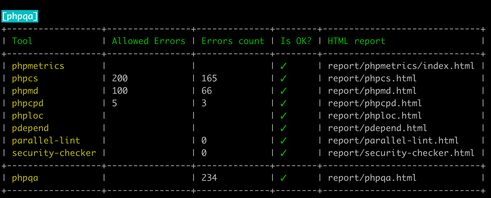
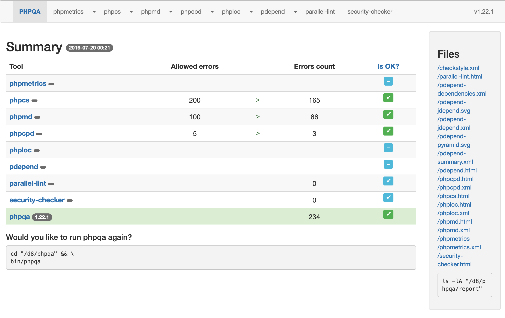

# Drupal PHPQA
[PHPQA](https://github.com/EdgedesignCZ/phpqa) with [Drupal](https://www.drupal.org) specific configurations.

## Installation

Create as a composer project on drupal root directory.

```
cd path/to/drupal
composer create-project vijaycs85/drupal-phpqa --stability dev -vvv phpqa
```

## Usage
```
cd path/to/drupal
cd phpqa
bin/phpqa
```

By default it runs below checks (on core [node]() module):

 Tool | Description
 -------------| ----------------------- |
[phpmetrics](https://github.com/Halleck45/PhpMetrics) | Static analysis tool for PHP |
[phpcs](https://github.com/squizlabs/PHP_CodeSniffer) | Detect violations of a coding standard |
[phpmd](https://github.com/phpmd/phpmd) | Scan PHP project for messy code |
[phpcpd](https://github.com/sebastianbergmann/phpcpd) | Copy/Paste Detector (CPD) for PHP code |
[phploc](https://github.com/sebastianbergmann/phploc) | Measure the size of a PHP project |
[pdepend](https://github.com/pdepend/pdepend) | PHP adaptation of JDepend |
[parallel-lint](https://github.com/JakubOnderka/PHP-Parallel-Lint) | Check syntax of PHP files |
[security-checker](https://github.com/sensiolabs/security-checker) | Check composer.lock for known security issues |

CLI result would be:



Visiting `http://[drupalsite.url]/phpqa/report/phpqa.html` would look like this:



**NOTE**
- [phpunit](https://github.com/phpunit/phpunit) has version conflict with Drupal core phpunit version
- [phpstan](https://github.com/phpstan/phpstan) has conflicts.


## Configuration
All configurations in `phpqa/.phpqa.yml` can be overridden by passing cli parameters.
For example, `bin/phpqa --analyzedDirs ../core/modules/book` would run all
checks on book module.
Check PHPQA [README](https://github.com/EdgedesignCZ/phpqa#phpqa) for full list.
